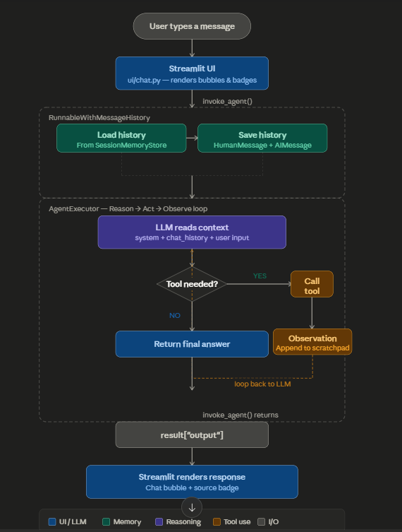

# Conversational KnowledgeBot —  AI with Memory & Tools

> A production-grade conversational chatbot built with LangChain, Groq (LLaMA 3.1),
> DuckDuckGo, Wikipedia, and Streamlit. It remembers your conversation, searches
> the web in real time, and gives contextual, factual answers.

<br>

[](https://python.org)
[](https://langchain.com)
[](https://streamlit.io)
[](https://console.groq.com)
[](LICENSE)

---

## 📌 Table of Contents

- [Features](#-features)
- [Architecture](#-architecture)
- [Project Structure](#-project-structure)
- [Tech Stack](#-tech-stack)
- [Setup & Installation](#-setup--installation)
- [Running the App](#-running-the-app)
- [Sample Conversations](#-sample-conversations)
- [Milestone Breakdown](#-milestone-breakdown)
- [Key Design Decisions](#-key-design-decisions)
- [Known Limitations](#-known-limitations)
- [Roadmap](#-roadmap)

---

## ✨ Features

| Feature | Description |
|---|---|
| 🧠 **Conversation Memory** | Remembers the full session — resolves pronouns and follow-ups |
| 🔍 **Web Search** | Real-time DuckDuckGo search — no API key required |
| 📚 **Wikipedia Lookup** | Encyclopedic knowledge via free Wikipedia API |
| 🤖 **Smart Tool Selection** | Agent automatically picks the right tool (or none) per query |
| 💬 **Chat Bubble UI** | Clean Streamlit interface with user/assistant bubbles |
| 🏷️ **Source Badges** | Every response shows which tool was used |
| 🔄 **Session Management** | Clear conversation or start a fresh session anytime |
| 🧩 **Modular Architecture** | Clean separation: agents / memory / tools / ui |

---

## 🏛️ Architecture

### High-Level Flow



### Two Memory Systems Working Together

```
┌─────────────────────────────────────────────────────────┐
│  st.session_state.messages          (UI layer)           │
│  ─────────────────────────                              │
│  Controls what chat BUBBLES appear on screen.           │
│  Replayed on every Streamlit rerun.                     │
└─────────────────────────────────────────────────────────┘

┌─────────────────────────────────────────────────────────┐
│  SessionMemoryStore (LangChain layer)                    │
│  ────────────────────────────────────                   │
│  Controls what CONTEXT the LLM receives.                │
│  Injected into chat_history placeholder each turn.      │
└─────────────────────────────────────────────────────────┘
```

### The Two Prompt Placeholders

```
Prompt sent to LLM on Turn N:
━━━━━━━━━━━━━━━━━━━━━━━━━━━━

SystemMessage:
  "You are KnowledgeBot..."

MessagesPlaceholder("chat_history")   ← ALL previous turns
  HumanMessage: "Who is Elon Musk?"
  AIMessage:    "Elon Musk is a billionaire..."
  HumanMessage: "Where was he born?"
  AIMessage:    "He was born in Pretoria..."

HumanMessage: "What is his net worth?"  ← current input

MessagesPlaceholder("agent_scratchpad")  ← tool calls THIS turn
  (empty at start, fills as tools are called)
```

---

## 📁 Project Structure

```
knowledge_bot/
│
├── run.py                        ← launch from here (project root)
├── requirements.txt
├── .env.example
├── .gitignore
├── README.md
│
├── src/                          ← learning progression (Milestones 1–5)
│   ├── test_llm.py               ← M1: LLM smoke test
│   ├── chatbot_basic.py          ← M2: stateless CLI chatbot
│   ├── chatbot_memory.py         ← M3: memory-enabled CLI chatbot
│   ├── chatbot_tools.py          ← M4: tool-enabled agent (no memory)
│   ├── chatbot_conversational.py ← M5: full conversational agent (CLI)
│   └── app.py                    ← M6: Streamlit UI (monolithic)
│
└── knowledge_bot/                ← production package (Milestone 7+)
    ├── __init__.py
    ├── config.py                 ← all settings (model, tokens, page config)
    ├── app.py                    ← thin Streamlit orchestrator (~60 lines)
    │
    ├── agents/
    │   ├── __init__.py
    │   └── conversational.py     ← LLM + prompt + executor + memory wrapper
    │
    ├── memory/
    │   ├── __init__.py
    │   └── store.py              ← SessionMemoryStore class
    │
    ├── tools/
    │   ├── __init__.py
    │   └── search.py             ← web_search + wikipedia tool builders
    │
    └── ui/
        ├── __init__.py
        ├── sidebar.py            ← status + stats + memory inspector + controls
        └── chat.py               ← header + welcome + history + process_input
```

---

## 🛠️ Tech Stack

| Layer | Technology | Purpose |
|---|---|---|
| **LLM** | Groq `llama-3.1-8b-instant` | Fast, free inference |
| **Framework** | LangChain 0.3.x | Agent, memory, tools orchestration |
| **Memory** | `ChatMessageHistory` | In-process session store |
| **Tool 1** | DuckDuckGo Search | Real-time web search (no API key) |
| **Tool 2** | Wikipedia API | Encyclopedic knowledge (no API key) |
| **UI** | Streamlit 1.45 | Chat interface |
| **Config** | python-dotenv | Environment variable management |
| **Styling** | Rich (CLI) / CSS (UI) | Output formatting |

---

## ⚙️ Setup & Installation

### Prerequisites

- Python 3.10 or higher
- A free [Groq API key](https://console.groq.com)

### Step 1 — Clone the Repository

```bash
git clone https://github.com/YOUR_USERNAME/knowledge-bot.git
cd knowledge-bot
```

### Step 2 — Create a Virtual Environment

```bash
# Create
python -m venv venv

# Activate (Windows)
venv\Scripts\activate

# Activate (Mac/Linux)
source venv/bin/activate
```

### Step 3 — Install Dependencies

```bash
pip install -r requirements.txt
```

### Step 4 — Configure API Key

```bash
# Copy the template
cp .env.example .env

# Open .env and add your key
GROQ_API_KEY=your_groq_api_key_here
```

Get your **free** Groq key at [console.groq.com](https://console.groq.com) →
Sign up → Create API Key. Free tier gives ~14,400 tokens/minute.

---

## ▶️ Running the App

### Streamlit UI (recommended)

```bash
# From the project root (knowledge_bot/ folder)
streamlit run run.py
```

Open [http://localhost:8501](http://localhost:8501) in your browser.

### CLI Versions (learning progression)

```bash
# Milestone 1 — LLM smoke test
python src/test_llm.py

# Milestone 2 — Stateless CLI chatbot
python src/chatbot_basic.py

# Milestone 3 — Memory-enabled CLI chatbot
python src/chatbot_memory.py

# Milestone 4 — Tool-enabled agent (no memory)
python src/chatbot_tools.py

# Milestone 5 — Full conversational agent (CLI)
python src/chatbot_conversational.py
```

---

## 💬 Sample Conversations

### 1. Memory — Pronoun Resolution

```
You:  Who is Elon Musk?
Bot:  Elon Musk is a billionaire entrepreneur and business magnate.
      He is the CEO of Tesla and SpaceX, and owns X (formerly Twitter).

You:  Where was he born?
Bot:  Elon Musk was born in Pretoria, South Africa, on June 28, 1971.
      [Sources used: 🔍 wikipedia]

You:  What companies has he founded?
Bot:  Elon Musk has founded or co-founded several major companies,
      including SpaceX (2002), Tesla (joined 2004), Neuralink (2016),
      and The Boring Company (2016).
      [Sources used: 🔍 wikipedia]
```

### 2. Tool Selection — Web Search vs Wikipedia

```
You:  Who won the last IPL match?
Bot:  [searches web_search in real time]
      According to recent results, ...
      [Sources used: 🔍 web_search]

You:  What is the Indian Premier League?
Bot:  [uses wikipedia]
      The Indian Premier League (IPL) is a professional Twenty20
      cricket league in India, founded in 2008 by the BCCI.
      [Sources used: 🔍 wikipedia]
```

### 3. No Tool Needed — Direct Answer

```
You:  What is 15% of 340?
Bot:  15% of 340 is 51.

You:  What is the capital of France?
Bot:  The capital of France is Paris.
```

### 4. Multi-Turn Context Chaining

```
You:  Who is the CEO of OpenAI?
Bot:  The CEO of OpenAI is Sam Altman.
      [Sources used: 🔍 web_search]

You:  Where did he study?
Bot:  Sam Altman studied computer science at Stanford University,
      though he dropped out after his freshman year to co-found Loopt.
      [Sources used: 🔍 wikipedia]

You:  What did he do before OpenAI?
Bot:  Before joining OpenAI, Sam Altman was the president of Y Combinator
      from 2014 to 2019, one of the world's most prestigious startup
      accelerators. Prior to that, he co-founded Loopt, a location-based
      social networking app, in 2005.
      [Sources used: 🔍 wikipedia]
```

---

## 🗺️ Milestone Breakdown

| Milestone | What Was Built | Key Concept Learned |
|---|---|---|
| **M1** | Project setup + LLM test | LangChain + Groq connection |
| **M2** | Stateless CLI chatbot | `ChatPromptTemplate`, LCEL pipe `\|` |
| **M3** | Memory-enabled chatbot | `ChatMessageHistory`, `RunnableWithMessageHistory` |
| **M4** | Tool-enabled agent | `AgentExecutor`, `create_tool_calling_agent`, ReAct loop |
| **M5** | Memory + Tools combined | Two `MessagesPlaceholder`s, full agent |
| **M6** | Streamlit chat UI | `st.session_state`, `@st.cache_resource`, chat bubbles |
| **M7** | Modular refactor | Clean architecture, relative imports, dependency flow |
| **M8** | README + GitHub | Documentation, portfolio presentation |

---

## 🔑 Key Design Decisions

### Why Groq instead of OpenAI?
Groq offers a **free tier** with fast inference on LLaMA 3.1 — no credit card
required. The LangChain interface is identical, so swapping to OpenAI requires
changing exactly one line in `config.py`.

### Why `output_messages_key` is omitted from `RunnableWithMessageHistory`
`AgentExecutor` returns `result["output"]` as a **plain string**.
`output_messages_key` tells the memory wrapper to treat that value as a list
of `BaseMessage` objects — causing a type mismatch that silently drops the
answer. Without it, the wrapper correctly saves the string as an `AIMessage`.

### Why relative imports inside the package?
When Streamlit runs a file as `__main__`, the file's directory is NOT
automatically a package. Relative imports (`.config`, `..memory`) ensure
sibling modules are resolved correctly regardless of how the app is launched.

### Why `@st.cache_resource` on `build_agent()`?
Streamlit reruns the entire script on every user action. Without caching,
the LLM + tools + chains would be rebuilt on every message (~2-3s delay).
`@st.cache_resource` builds the agent once and shares it across all reruns.

---

## ⚠️ Known Limitations

- **In-memory store only** — session history is lost on app restart.
  For persistence, swap `ChatMessageHistory` with a Redis or DB backend.
- **Single-user session** — all users of the same running instance share
  the agent cache. Sessions are isolated by `session_id` but run in the
  same process.
- **DuckDuckGo rate limits** — heavy use may trigger temporary blocks.
  The tool handles this gracefully but answers may fall back to LLM knowledge.
- **Context window** — very long conversations may exceed the LLM's context
  window. Milestone 9 addresses this with `ConversationSummaryMemory`.

---

## 🔭 Roadmap

- [ ] **Milestone 9** — `ConversationSummaryMemory` + custom knowledge base (PDF/JSON)
- [ ] Redis backend for persistent cross-session memory
- [ ] User authentication + per-user session isolation
- [ ] Streaming responses (`st.write_stream`)
- [ ] LangSmith tracing for production observability
- [ ] Docker deployment

---

## 📄 License

MIT License — see [LICENSE](LICENSE) for details.

---

## 🙏 Acknowledgements

- [LangChain](https://langchain.com) — the agent and memory framework
- [Groq](https://console.groq.com) — free LLM inference
- [Streamlit](https://streamlit.io) — the UI framework
- [DuckDuckGo](https://duckduckgo.com) — free web search
- [Wikipedia](https://wikipedia.org) — free encyclopedic knowledge

---

<div align="center">
  <sub>Built milestone by milestone as a production learning project.</sub>
</div>